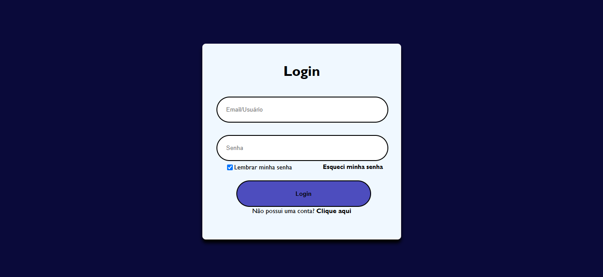

# Tela de Login com HTML e CSS

Este é o meu primeiro projeto como desenvolvedor web!  
Criei uma tela de login simples utilizando apenas HTML e CSS, com foco em praticar estruturação de página e estilização básica.

## Funcionalidades

- Campo de usuário 
- Campo de senha
- Checkbox para lembrar senha
- Opção de link para redefinição e primeiro acesso 
- Estilo moderno e responsivo
- Sem JavaScript — apenas HTML e CSS

## Preview

